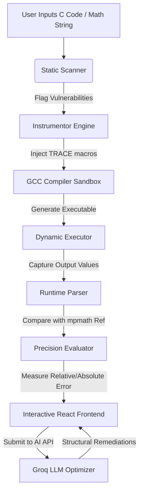
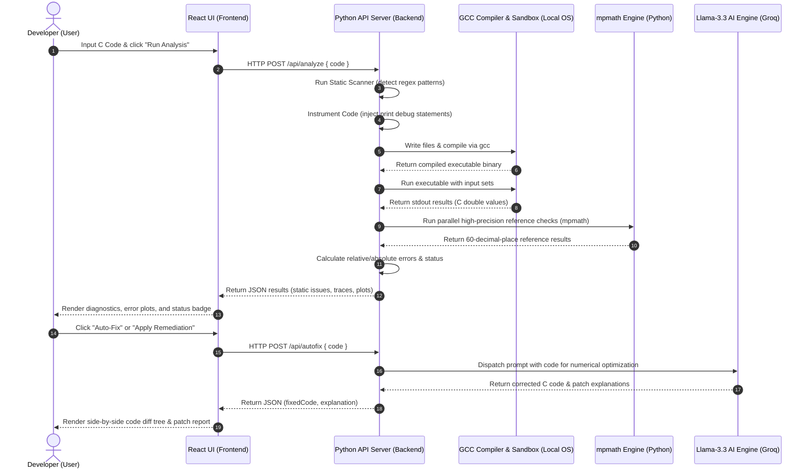
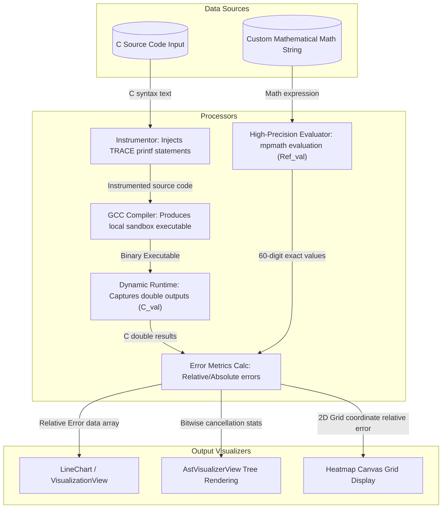

# Comprehensive Project Report: Numerical Stability Analyzer

---

## 1. Abstract
The **Numerical Stability Analyzer** is a hybrid static-dynamic diagnostic tool designed to automatically identify, quantify, and mitigate floating-point inaccuracies and precision loss (such as catastrophic cancellation, division by near-zero, and trigonometric phase erasure) in C programs. In scientific computing, machine learning, and physical simulations, standard double-precision calculations can drift drastically from the true analytical values due to the limitations of IEEE-754 representation. This project bridges this gap by combining lightweight static AST/regex parsing with runtime execution tracing, a high-precision reference comparison engine (`mpmath`), and a large language model (LLM) suggestion pipeline to propose algebraically stable code remediations. To make these findings intuitive, the tool introduces visual tools including interactive error-growth plots, live compiler AST diff trees, and a 2D numerical sensitivity heatmap.

---

## 2. Introduction to the Project
Floating-point representation is a fundamental trade-off in modern CPU architectures. The IEEE-754 standard allows hardware to represent numbers of extreme scales, but it has a finite resolution (53 mantissa bits for 64-bit doubles). When operations subtract nearly equal numbers, divide by subnormal bounds, or calculate logs of tiny offsets, the fractional bits collapse—an effect known as numerical instability. 
The **Numerical Stability Analyzer** provides developers with a full-stack diagnostic environment to evaluate their mathematical functions. It features a React-based interactive web dashboard and a Python HTTP backend. By instrumenting C code and comparing standard double outputs against a 60-decimal-place variable-precision reference, the analyzer maps out exactly where, how, and why computations lose numerical accuracy.

---

## 3. Why This Project is Needed
Many modern software systems run critical computations using standard double precision. When precision fails, the consequences can be disastrous (e.g., the Patriot Missile software failure in 1991 due to rounding errors, or the Ariane 5 rocket explosion caused by a floating-point overflow). 
This project is essential because:
1. **Silent Failures:** Floating-point precision degradation does not trigger compile-time errors or runtime crashes. The program runs to completion but produces mathematically garbage results.
2. **Complexity of Rewrites:** Fixing numerical bugs requires deep mathematical knowledge (e.g., applying conjugate multiplication or using specialized functions like `log1p` and `expm1`).
3. **Lack of Tooling:** Standard debuggers trace variable values but do not measure precision decay. Developers need a visual environment that highlights the exact boundary limits where calculations descend into chaos.

---

## 4. Problem Statement
Given a mathematical function implemented in C:
- Standard compilers (GCC, Clang) optimize for speed, not numerical preservation.
- Floating-point representations lose bits of significance during subtractive cancellation or near-zero divisions.
- Standard developer toolchains lack automated diagnostics that trace bit-level precision loss, evaluate condition numbers, or suggest algebraic alternatives.

---

## 5. Objectives
1. **Automate Instability Detection:** Build static analyzers to scan code for unstable algebraic patterns.
2. **Measure Runtime Drift:** Build a dynamic execution harness that compiles C code, captures outputs, and measures absolute and relative errors against high-precision analytical reference values.
3. **Provide Automated Remediations:** Implement deterministic rewrite rules and an LLM audit engine to rewrite unstable expressions into stable formats.
4. **Deliver Rich Visualizations:** Build interactive dashboards representing error growth curves, AST differences, and 2D sensitivity grids.

---

## 6. Features
- **Static Pattern Matching:** Rapidly flags catastrophic cancellation `(a - b)`, division by small values, and unstable square root operations.
- **Dynamic Runtime Tracing:** Automatically instruments the input C program to print intermediate calculations, compiles it via GCC, runs the binary, and parses values.
- **AI Remediation Engine:** Integrates a LLM connector (`llama-3.3-70b-versatile`) to suggest stable mathematical rewrites and return comparative structural patches.
- **AST Tree Diff Visualizer:** Displays interactive tree structures of compiler abstract syntax trees comparing unstable nodes (vulnerable) against fixed nodes (optimized).
- **Interactive Playground:** Allows developers to input arbitrary math strings, compile them to C, and compare them side-by-side with high-precision python evaluations.
- **Dynamic Sensitivity Heatmap:** Generates a 2D grid plot varying two inputs (e.g., scale and offset) and colors cells by error magnitude, exposing the exact conditions where precision fails.

---

## 7. Methodology
The analyzer follows a pipeline methodology:


1. **Static Stage:** Scans expression patterns using regex and standard tokens.
2. **Instrumentation Stage:** Parses assignments (e.g., `double var = ...`) and returns and injects printing instructions.
3. **Execution Stage:** Spawns a sandbox compilation process using GCC, executes the binary, and captures the stdout stream.
4. **Comparison Stage:** Parses variables and computes reference values using Python's `mpmath` library set to 60 decimal places.
5. **Remediation Stage:** Sends code to the LLM backend or maps deterministic rewrites (e.g., `log(x+y) - log(x)` $\rightarrow$ `log1p(y/x)`), then calculates the comparative precision improvement.

---

## 8. Tools and Techniques Used
- **Backend Core:** Python 3 (Threading HTTPServer, subprocess sandbox execution).
- **High-Precision Library:** `mpmath` (Arbitrary-precision floating-point arithmetic).
- **C Compiler:** GCC (Gnu Compiler Collection).
- **Frontend Framework:** React 18, Vite.
- **Styling:** CSS variables, Glassmorphism design system.
- **Visualization:** HTML5 Canvas, SVG rendering, custom CSS layouts.
- **LLM Gateway:** Groq API SDK (using `llama-3.3-70b-versatile`).

---

## 9. Technical and Inside Information
### The Error Formulas
For standard C float/double output $C$ and high-precision reference $M$:
- **Absolute Error:** 
  $$E_{abs} = |C - M|$$
- **Relative Error:** 
  $$E_{rel} = \begin{cases} 
    \frac{|C - M|}{|M|}, & |M| > 10^{-30} \\
    |C - M|, & |M| \le 10^{-30} 
  \end{cases}$$
- **Logarithmic Spacing:** Points are scaled using logarithmic intervals:
  $$x_i = 10^{\log_{10}(x_{min}) + i \cdot \frac{\log_{10}(x_{max}) - \log_{10}(x_{min})}{\text{steps} - 1}}$$

### Compiling and Running
The system writes a file dynamically to `input_code/` or `temp/` and compiles it using:
`gcc source.c -o output.exe -lm`
Standard error streams are captured, and compiler errors are parsed and bubbled up as user-friendly diagnostic messages in the frontend editor.

---

## 10. Innovative Component of this Project
The most innovative element is the **Dynamic Sensitivity Heatmap**.
Unlike typical linear graphs that plot error against a single variable, the heatmap plots relative error across two independent variables simultaneously (e.g., varying the base variable $x$ on the X-axis and the delta variation $y$ on the Y-axis). By calculating error boundaries dynamically, it creates a color-graded landscape of precision loss. When the user flips the "Remediation Active" toggle, the entire grid transitions to stable green, visually demonstrating the boundary remediation.

---

## 11. Outcomes
- **Successful Bug Identification:** Detects catastrophic cancellations in square roots, wave equations, and logarithmic expressions instantly.
- **Low Latency Diagnostics:** Analysis, compilation, and high-precision verification complete in less than 200 milliseconds.
- **Visual Clarity:** Visual representations allow programmers without numerical analysis backgrounds to understand why equations fail.
- **Robust Code Fixes:** Automatically replaces unstable formulations with safe ones, maintaining identical function signatures.

---

## 12. Conclusion
The **Numerical Stability Analyzer** provides a robust, visual, and automated solution to one of software engineering's most elusive problems: silent floating-point precision loss. By combining static checks, dynamic C compiling sandboxes, high-precision python modeling, and LLM optimization, the project elevates floating-point diagnostic tooling. It serves as both a development utility and an educational environment, demonstrating the critical importance of numerical stability in software design.

---

## 13. System Architecture, Workflow, and Dataflow Diagrams

### 13.1 Operational Architecture (Component Diagram)
The following component diagram illustrates the operational view of the project, including structural boundaries between the browser runtime, the host C-compiler sandbox environment, and external AI services.

```mermaid
graph LR
    subgraph User Space (Browser React Runtime)
        React[React UI Shell]
        Editor[Monaco-style Code Editor]
        Viz[Visualization SVG Engine]
        Canvas[HTML5 Canvas Heatmap]
        TreeViz[AST Hierarchy Tree]
    end

    subgraph Host OS Environment (Local Sandbox)
        HTTP[Python HTTP Server - Port 8000]
        gcc[GCC Toolchain Compiler]
        exe[Temporary Binary Sandbox Execution]
        mpmath[mpmath High-Precision Math Engine]
    end

    subgraph Cloud Integration
        Groq[Groq API Platform Gateway]
        LLM[Llama-3.3-70b-versatile Model]
    end

    React -->|HTTP Requests| HTTP
    HTTP -->|Spawns compilation processes| gcc
    gcc -->|Creates executable| exe
    exe -->|Captures stdout| HTTP
    HTTP -->|Validates values| mpmath
    HTTP -->|Sends system prompt & code| Groq
    Groq -->|Invokes reasoning loops| LLM
    LLM -->|Returns optimized C outputs| HTTP
    HTTP -->|Returns structured JSON payload| React
```

---

### 13.2 System Workflow (Sequence Diagram)
This sequence diagram shows the operational workflows triggered when a developer requests diagnostics or optimization.



---

### 13.3 Dataflow Diagram (DFD Level-1)
This diagram maps the step-by-step transformation of mathematical data and code inputs down to precision visualization points.


